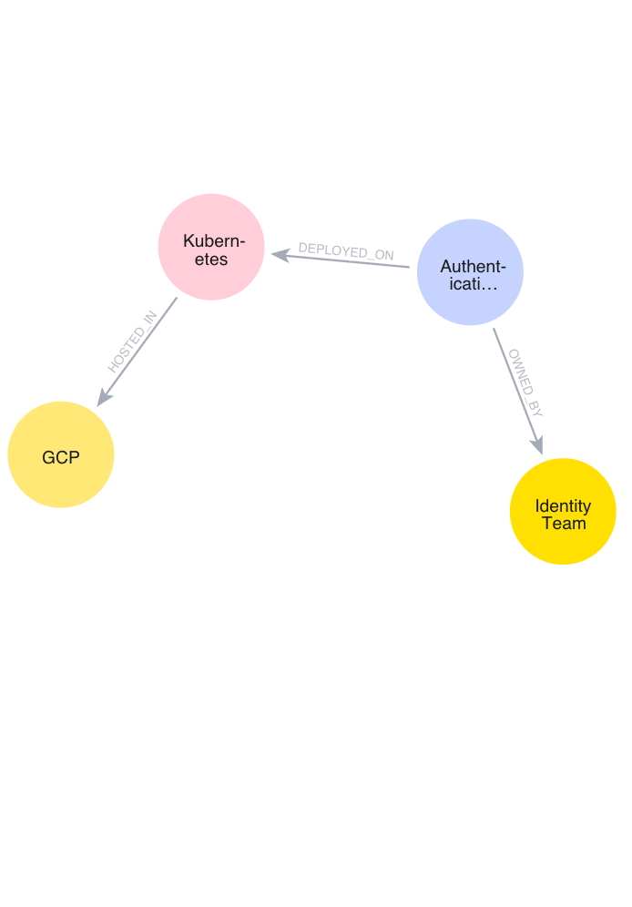

# knowledge-graph-ai

This project converts unstructured enterprise documents into a knowledge graph and enables natural language queries.

The extracted entities and relationships are stored in Neo4j and visualized as a knowledge graph.

Example:

## Architecture

Documents
↓
Entity Extraction
↓
Relationship Extraction
↓
Graph Builder
↓
Neo4j Graph Database
↓
Query Engine
↓
FastAPI API
